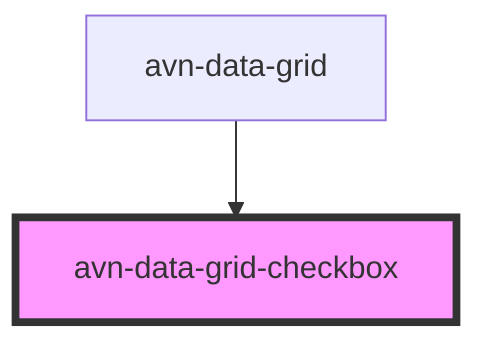

# avn-data-grid-checkbox

<!-- Auto Generated Below -->

## Properties

| Property  | Attribute | Description | Type      | Default |
| --------- | --------- | ----------- | --------- | ------- |
| `checked` | `checked` |             | `boolean` | `false` |

## Slots

| Slot | Description              |
| ---- | ------------------------ |
|      | Default slot for content |

## CSS Custom Properties

| Name                              | Description                          |
| --------------------------------- | ------------------------------------ |
| `--checkbox-background`           | Background colour for the checkbox   |
| `--checkbox-border-color`         | Colour to use for the border         |
| `--checkbox-checkmark-background` | Colour to apply to the checkmark     |
| `--checkbox-label-margin`         | Margin for the label of the checkbox |

## Dependencies

### Used by

 - [avn-data-grid](../avn-data-grid)

### Graph

----------------------------------------------

*Built with [StencilJS](https://stenciljs.com/)*
