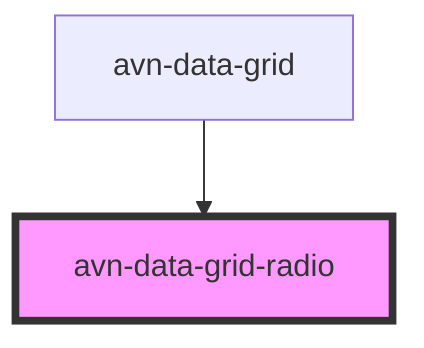

# avn-data-grid-radio

<!-- Auto Generated Below -->

## Properties

| Property  | Attribute | Description | Type      | Default |
| --------- | --------- | ----------- | --------- | ------- |
| `checked` | `checked` |             | `boolean` | `false` |

## Slots

| Slot | Description                                                |
| ---- | ---------------------------------------------------------- |
|      | The content to be displayed inside the radio button label. |

## CSS Custom Properties

| Name                           | Description                       |
| ------------------------------ | --------------------------------- |
| `--radio-background`           | Background colour for the radio   |
| `--radio-border-color`         | Colour to use for the border      |
| `--radio-checkmark-background` | Colour to apply to the checkmark  |
| `--radio-label-margin`         | Margin for the label of the radio |

## Dependencies

### Used by

 - [avn-data-grid](../avn-data-grid)

### Graph

----------------------------------------------

*Built with [StencilJS](https://stenciljs.com/)*
