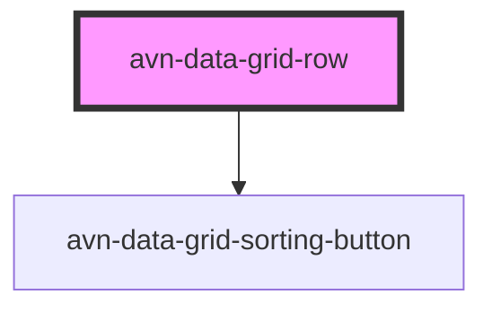

# avn-data-grid-row

<!-- Auto Generated Below -->

## Overview

This component represents a row in an `avn-data-grid` component.

## Properties

| Property   | Attribute  | Description                                             | Type      | Default     |
| ---------- | ---------- | ------------------------------------------------------- | --------- | ----------- |
| `heading`  | `heading`  | Indicates whether the row is a heading row or not.      | `boolean` | `false`     |
| `selected` | `selected` | Indicates whether the row is currently selected or not. | `boolean` | `undefined` |

## Events

| Event                | Description                                                                    | Type               |
| -------------------- | ------------------------------------------------------------------------------ | ------------------ |
| `avnDataGridSorting` | Emitted when a user clicks on a sortable cell to sort the grid by that column. | `CustomEvent<any>` |

## CSS Custom Properties

| Name                        | Description                                                                                     |
| --------------------------- | ----------------------------------------------------------------------------------------------- |
| `--row-background`          | Background colour for the row                                                                   |
| `--row-background--heading` | Background colour for heading row                                                               |
| `--row-padding`             | Padding to apply for element `<avn-data-grid-cell></avn-data-grid-cell>` within the row element |

## Dependencies

### Depends on

- [avn-data-grid-sorting-button](../avn-data-grid-sorting-button)

### Graph

----------------------------------------------

*Built with [StencilJS](https://stenciljs.com/)*
