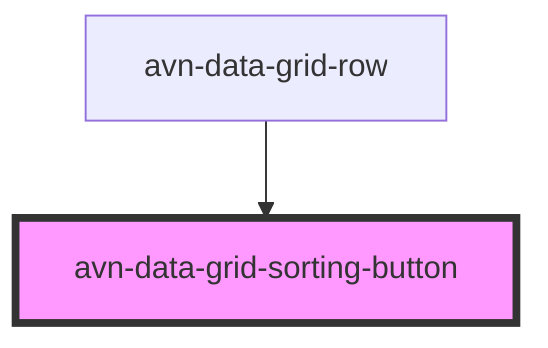

# avn-data-grid-sorting-button

<!-- Auto Generated Below -->

## Overview

A button component for sorting data grid columns in ascending or descending order.

## Properties

| Property | Attribute | Description                                                        | Type              | Default     |
| -------- | --------- | ------------------------------------------------------------------ | ----------------- | ----------- |
| `value`  | `value`   | The current sorting direction, can be 'asc', 'desc', or undefined. | `"asc" \| "desc"` | `undefined` |

## Events

| Event                | Description                                                                   | Type                           |
| -------------------- | ----------------------------------------------------------------------------- | ------------------------------ |
| `avnDataGridSorting` | Triggered when the button is clicked, emitting the current sorting direction. | `CustomEvent<"asc" \| "desc">` |

## Dependencies

### Used by

 - [avn-data-grid-row](../avn-data-grid-row)

### Graph

----------------------------------------------

*Built with [StencilJS](https://stenciljs.com/)*
