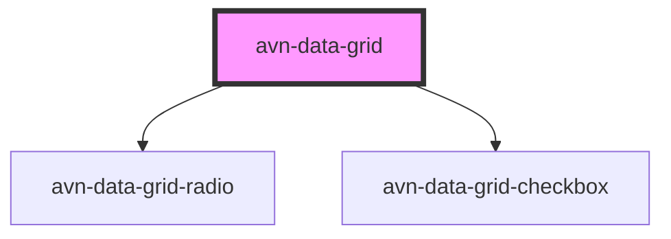

# avn-data-grid

<!-- Auto Generated Below -->

## Properties

| Property | Attribute | Description | Type                                | Default     |
| -------- | --------- | ----------- | ----------------------------------- | ----------- |
| `mode`   | `mode`    |             | `"multi-select" \| "single-select"` | `undefined` |

## CSS Custom Properties

| Name                | Description                                                   |
| ------------------- | ------------------------------------------------------------- |
| `--font-family`     | font to use                                                   |
| `--padding`         | padding used for the data grid                                |
| `--radius`          | radius used for the `border-radius` property of the data grid |
| `--shadow`          | shadow used for the `box-shadow` property of the data grid    |
| `--shadow-color`    | Colour of the shadow                                          |
| `--shadow-strength` | Strength of the shadow                                        |

## Dependencies

### Depends on

- [avn-data-grid-radio](../avn-data-grid-radio)
- [avn-data-grid-checkbox](../avn-data-grid-checkbox)

### Graph

----------------------------------------------

*Built with [StencilJS](https://stenciljs.com/)*
